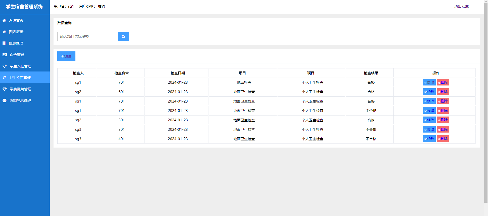

代码为作者2024年全新开发，全新ui，全新框架+技术，源码+论文，等你添加

**点我直接购买系统：https://ake999.com/26.html**

需要代码，联系微信 python_kk或者qq：976870170（备注github，不备注不通过）

需要代码，联系微信 python_kk或者qq：976870170（备注github，不备注不通过）

需要代码，联系微信 python_kk或者qq：976870170（备注github，不备注不通过）


一、主要技术：python、django、mysql、echarts、bootstrap、jquery、css、cookie、session等基本技术实现

**系统亮点1：python框架做毕设，做的人少！django开发便捷，容易毕业！！！！！！**

**系统亮点2：加入django结合echarts，可视化展示宿舍，导员，学生之间的关系！！！！！！**

**系统亮点3：多角色不同页面，管理员拥有管理员页面，宿管有宿管页面，学生有学生页面**

**系统亮点4：界面ui非常美观**


 二、主要功能:

管理员功能：

```
系统首页
图表展示
信息管理
宿管管理
学生管理
宿舍管理
学生入住管理
卫生检查管理
学费缴纳管理
通知消息管理
```

通用功能：登录、退出、修改姓名、密码


四、登录


首页


echarts可视化展示


信息管理


宿管管理


学生管理


宿舍管理



学生入住管理


